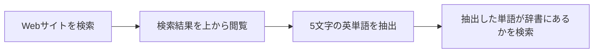
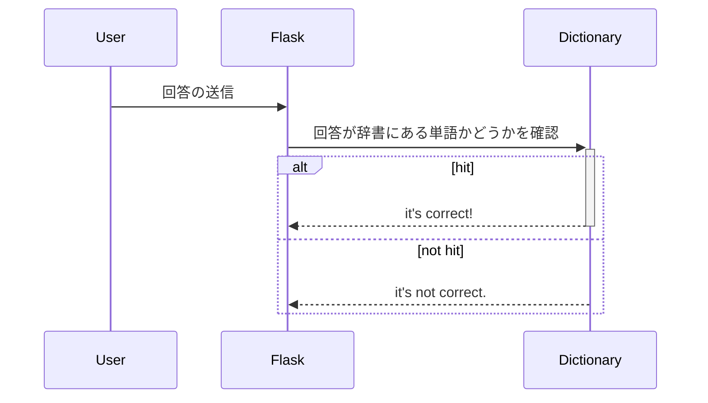

# Wordleのクローンアプリ

## 使用言語:
- python 3.10.2

## フレームワーク
- Flask 2.1.2

## ロジック

### ワードプールの作成

あらかじめ定められた検索エンジンもしくはサイト内にて特定の語句について検索を行い、その結果からあらかじめ定められた辞書に登録のある5文字の英単語を抽出しそれを、ワードプールとする。



### 回答の受付



## 界面設計

### スタート

初期化用データ

```json
{
    theme: "",
    sites: ["", ""]
}
```

### 回答の送信

```json
{
    answer: ""
}
```
